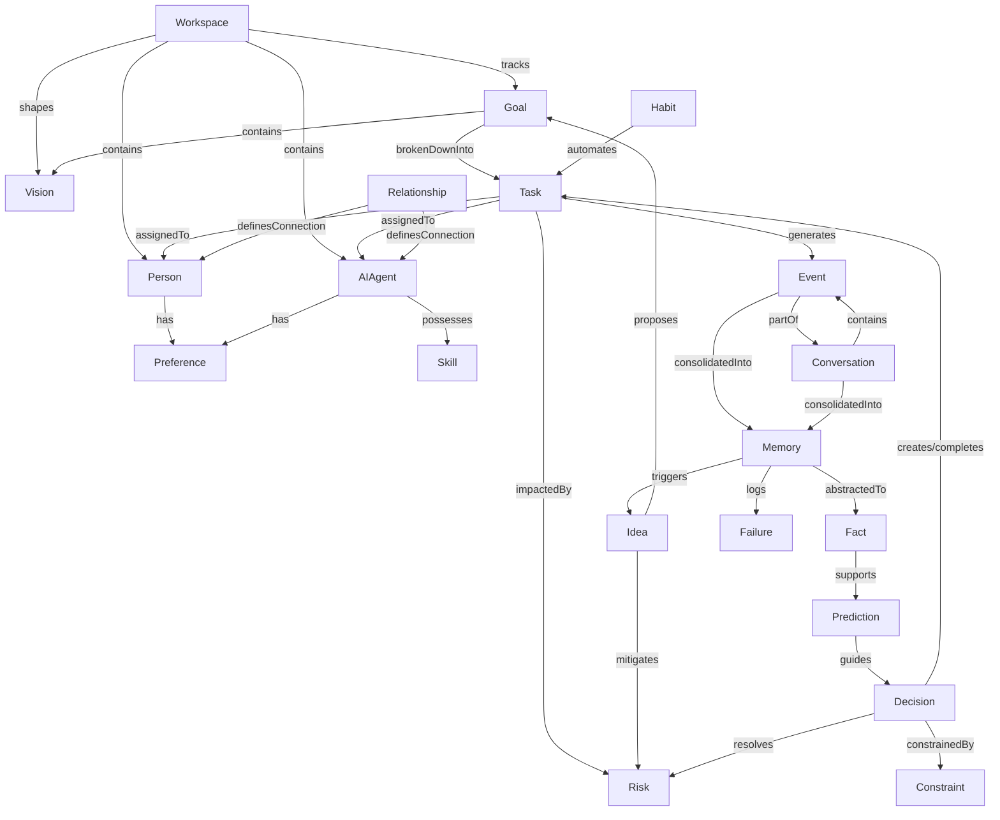

# Module: Workspace Contexts

The **Workspace** is the operational environment in which the Cognitive Operating System runs. It represents the unified state space containing all files, configurations, repositories, active agents, channels, and dependencies.

---

## 1. Workspace State Representation

The workspace is modeled as a unified environment context:

```json
{
  "workspace_id": "workspace_mem_01",
  "base_path": "file:///c:/Users/user/Desktop/mem",
  "environments": {
    "development": {
      "path": "file:///c:/Users/user/Desktop/mem",
      "active_branch": "main"
    }
  },
  "bindings": {
    "git": {
      "provider": "local",
      "remote_url": "none"
    },
    "documents": {
      "format": "markdown",
      "index_file": "mission.txt"
    },
    "agents": [
      {
        "agent_id": "antigravity_co_founder",
        "role": "co-founder/architect",
        "status": "active"
      }
    ]
  },
  "state_sync": {
    "last_sync_timestamp": "2026-06-13T11:53:00Z",
    "dirty_files": []
  }
}
```

---

## 2. Integration Layer

The Workspace binds external tools to our cognitive modules:

```
    ┌────────────────────────────────────────────────────────┐
    │                       Workspace                        │
    │                                                        │
    │    ┌───────────────┐  ┌───────────────┐  ┌────────┐    │
    │    │  Git Repo     │  │  Chats/Slack  │  │  Docs  │    │
    │    └───────┬───────┘  └───────┬───────┘  └───┬────┘    │
    └────────────┼──────────────────┼──────────────┼─────────┘
                 │                  │              │
                 ▼                  ▼              ▼
             (Commits)         (Discussions)    (Wiki/Edits)
                 │                  │              │
                 └──────────┬───────┴──────────────┘
                            │
                            ▼
                    Perception Module (Normalises to Perceived Events)
```

1. **Deterministic Binding**: Files, directories, and database entities have direct URI representation. Any mutating action targeting a workspace path maps to a corresponding system write call.
2. **Context Assembly**: When an agent begins a task, the Workspace module automatically packages the relevant files and past decisions into a single local context block. This prevents the agent from searching the entire disk and focuses attention on the exact workspace boundary of the task.

---

## 3. Knowledge Ontology Specification

Rather than designing database schemas first, the Cognitive OS builds on a semantic graph of the workspace. Below are the definitions, properties, and relationships of the 20 core concepts.

### 3.1 Ontology Diagram



### 3.2 Concept Glossary & Properties

1. **Workspace**: The global root context.
   - *Properties*: `workspace_id` (UUID), `base_path` (URI), `active_bindings` (List).
2. **Person**: A human team member.
   - *Properties*: `person_id` (UUID), `name` (String), `role` (String), `communication_address` (String).
3. **AI Agent**: A software agent with operational capabilities.
   - *Properties*: `agent_id` (UUID), `role` (String), `model_type` (String), `status` (Enum: active, idle, offline).
4. **Goal**: A strategic target.
   - *Properties*: `goal_id` (UUID), `description` (String), `target_date` (Timestamp), `priority` (Int), `status` (Enum: pending, active, achieved).
5. **Vision**: A long-term guiding target state.
   - *Properties*: `vision_statement` (String), `horizon_years` (Int).
6. **Decision**: A committed path selection.
   - *Properties*: `decision_id` (UUID), `alternatives_simulated` (List), `chosen_option` (String), `rationale` (String), `timestamp` (Timestamp).
7. **Task**: An actionable item of work.
   - *Properties*: `task_id` (UUID), `assigned_entity` (UUID), `status` (Enum), `dependencies` (List), `parent_goal_id` (UUID).
8. **Event**: A single timestamped occurrence.
   - *Properties*: `event_id` (UUID), `timestamp` (Timestamp), `source` (String), `payload` (JSON), `confidence` (Float).
9. **Conversation**: A sequence of conversational events.
   - *Properties*: `conversation_id` (UUID), `participants` (List), `timestamp_range` (Range), `topic_tags` (List).
10. **Fact**: A validated semantic statement.
    - *Properties*: `fact_id` (UUID), `subject` (String), `predicate` (String), `object` (String), `confidence_rating` (Float), `validation_source` (UUID).
11. **Idea**: A proposal or insight.
    - *Properties*: `idea_id` (UUID), `description` (String), `creator_id` (UUID), `timestamp` (Timestamp), `maturity_score` (Float).
12. **Risk**: A potential failure mode.
    - *Properties*: `risk_id` (UUID), `description` (String), `probability` (Float), `impact_severity` (Float), `mitigation_strategy` (String).
13. **Constraint**: A hard rule governing system states.
    - *Properties*: `constraint_id` (UUID), `scope` (String), `expression` (String), `is_hard_limit` (Boolean).
14. **Relationship**: A trust/collaboration vector between agents.
    - *Properties*: `relationship_id` (UUID), `source_id` (UUID), `target_id` (UUID), `trust_score` (Float), `interaction_frequency` (Float).
15. **Skill**: A registered procedural action capability.
    - *Properties*: `skill_id` (UUID), `name` (String), `trigger_pattern` (Regex), `execution_script_uri` (URI).
16. **Preference**: Configuration preferences of humans or agents.
    - *Properties*: `preference_id` (UUID), `owner_id` (UUID), `setting_key` (String), `setting_value` (JSON).
17. **Failure**: A logged error or wrong prediction.
    - *Properties*: `failure_id` (UUID), `task_id` (UUID), `error_signature` (String), `stack_trace` (String), `resolution_heuristic` (String).
18. **Habit**: A recurring pattern of tasks.
    - *Properties*: `habit_id` (UUID), `associated_task_type` (String), `frequency_pattern` (CronExpression), `trigger_context` (JSON).
19. **Prediction**: A forecast state estimation.
    - *Properties*: `prediction_id` (UUID), `target_variable` (String), `expected_value` (JSON), `variance` (Float), `timestamp` (Timestamp).
20. **Memory**: A consolidated experience node.
    - *Properties*: `memory_id` (UUID), `memory_type` (Enum), `importance_weight` (Float), `decay_rate` (Float), `last_retrieved` (Timestamp).

### 3.3 Axiomatic Logic Rules

To maintain integrity, the graph must satisfy the following invariant logic formulas:

1. **Task Dependency Invariant**:
   $$\forall t \in \text{Tasks}, \quad \exists g \in \text{Goals} \quad \text{s.t.} \quad \text{childOf}(t, g)$$
   *(Every task must be a breakdown of a parent goal).*
2. **Decision Validation Invariant**:
   $$\forall d \in \text{Decisions}, \quad \text{Simulations}(d) \neq \emptyset \land \text{RiskAppraisal}(d) \neq \emptyset$$
   *(Decisions can only be committed if simulations and risk assessments have been conducted).*
3. **Fact Validation Invariant**:
   $$\forall f \in \text{Facts}, \quad \exists e \in (\text{Events} \cup \text{Conversations}) \quad \text{s.t.} \quad \text{abstractedFrom}(f, e)$$
   *(All facts in the ontology must have a traceable sensory provenance in episodic events or human conversations).*
4. **Constraint Invariant**:
   $$\forall a \in \text{Actions}, \quad \forall c \in \text{Constraints} \quad \text{s.t.} \quad \text{isHardLimit}(c) \implies \text{Violates}(a, c) = \text{False}$$
   *(No active mutation can violate a designated hard limit).*

